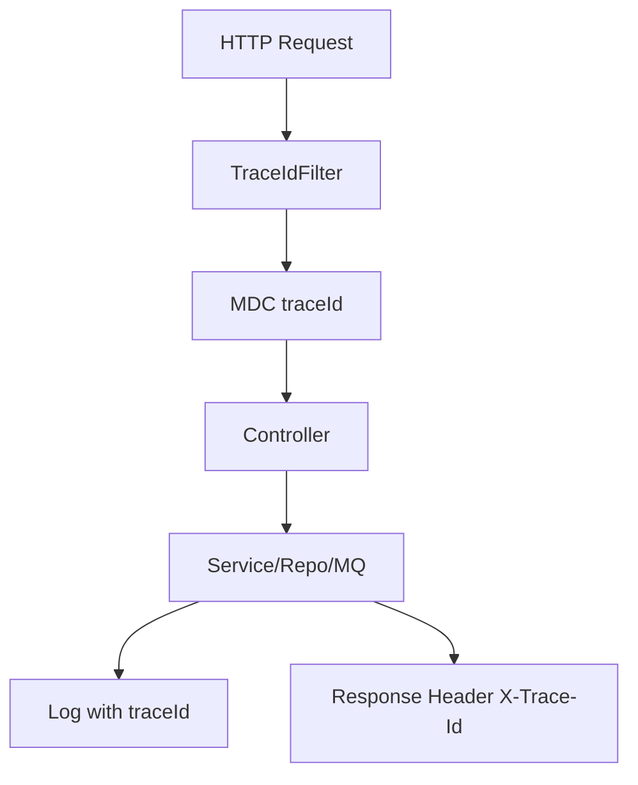
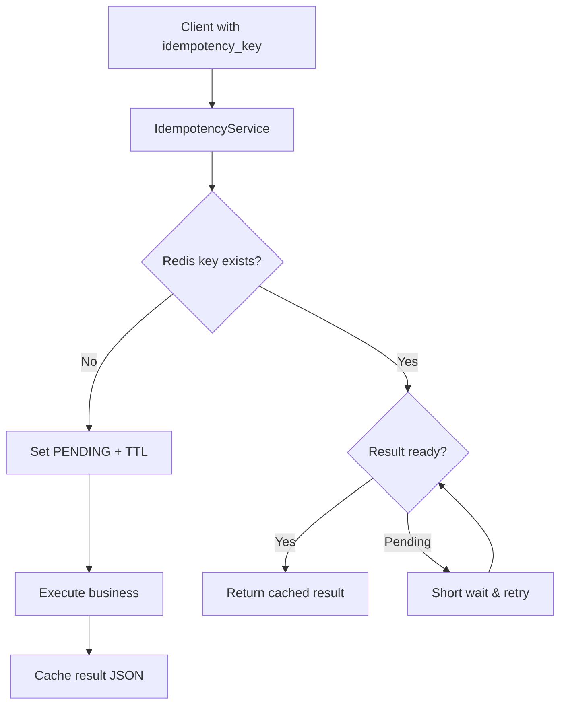
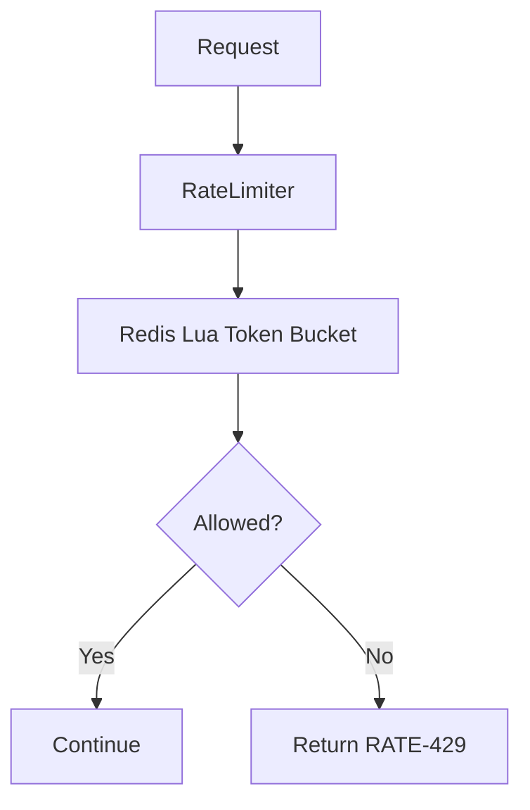

# Flowchart

## Trace 链路

```mermaid
flowchart TD
    A[HTTP Request] --> B[TraceIdFilter]
    B --> C[MDC traceId]
    C --> D[Controller]
    D --> E[Service/Repo/MQ]
    E --> F[Log with traceId]
    E --> G[Response Header X-Trace-Id]
```

## 幂等流程

```mermaid
flowchart TD
    A[Client with idempotency_key] --> B[IdempotencyService]
    B --> C{Redis key exists?}
    C -- No --> D[Set PENDING + TTL]
    D --> E[Execute business]
    E --> F[Cache result JSON]
    C -- Yes --> G{Result ready?}
    G -- Yes --> H[Return cached result]
    G -- Pending --> I[Short wait & retry]
    I --> G
```

## 限流流程

```mermaid
flowchart TD
    A[Request] --> B[RateLimiter]
    B --> C[Redis Lua Token Bucket]
    C --> D{Allowed?}
    D -- Yes --> E[Continue]
    D -- No --> F[Return RATE-429]
```
