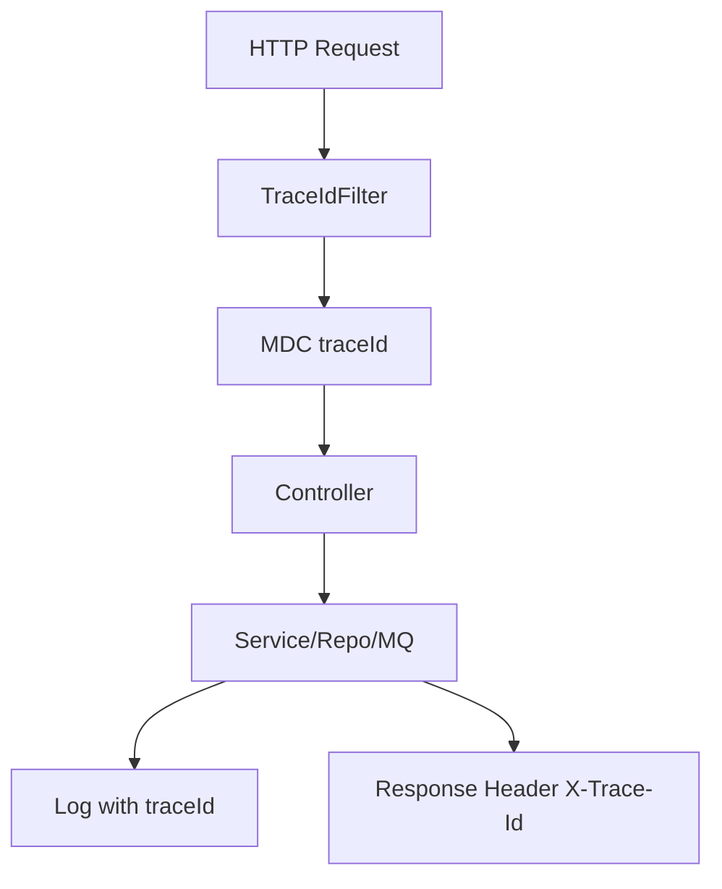
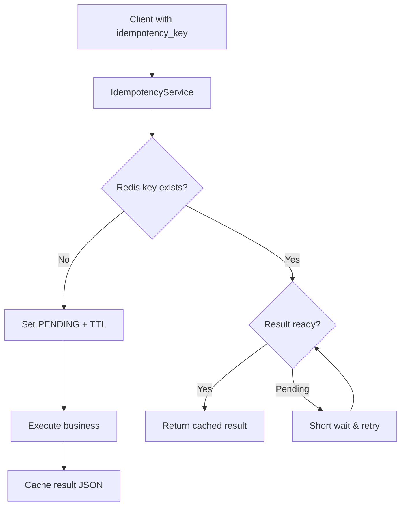
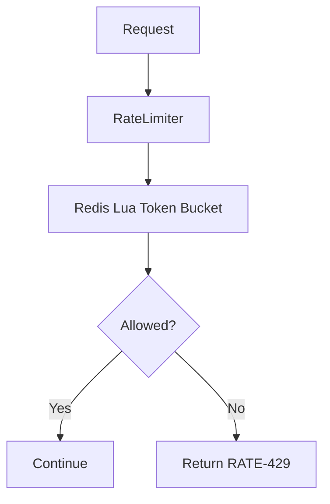
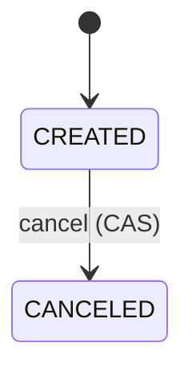
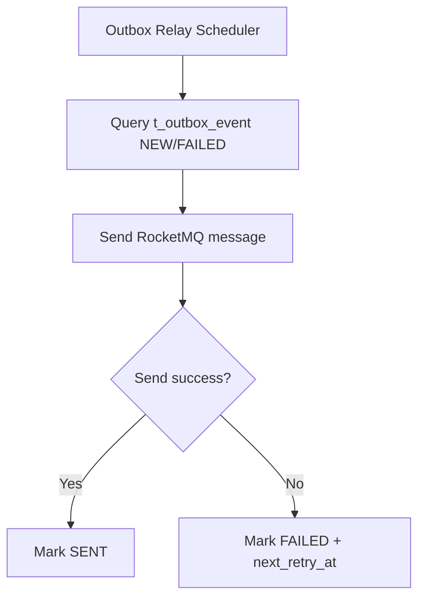

# Flowchart

## Trace 链路



## 幂等流程



## 限流流程



## 订单创建/取消流程（含幂等 + Outbox）

```mermaid
flowchart TD
    A[POST /orders] --> B[Resolve idempotency_key/clientRequestId]
    B --> C{Rate limit pass?}
    C -- No --> C1[Return RATE-429]
    C -- Yes --> D[IdempotencyService execute]
    D --> E{Order exists?}
    E -- Yes --> F[Return existing order]
    E -- No --> G[Insert t_order + t_order_item]
    G --> H[Insert t_order_state_flow CREATED]
    H --> I[Insert t_outbox_event OrderCreated]
    I --> J[Return order]

    K[POST /orders/{orderNo}/cancel] --> L[Resolve idempotency_key/clientRequestId]
    L --> M{Rate limit pass?}
    M -- No --> M1[Return RATE-429]
    M -- Yes --> N[IdempotencyService execute]
    N --> O{Status == CREATED?}
    O -- No --> P[Return error or already canceled]
    O -- Yes --> Q[CAS update status -> CANCELED]
    Q --> R[Insert t_order_state_flow CANCELED]
    R --> S[Insert t_outbox_event OrderCanceled]
    S --> T[Return order]
```

## 订单状态机



## Outbox Relay


