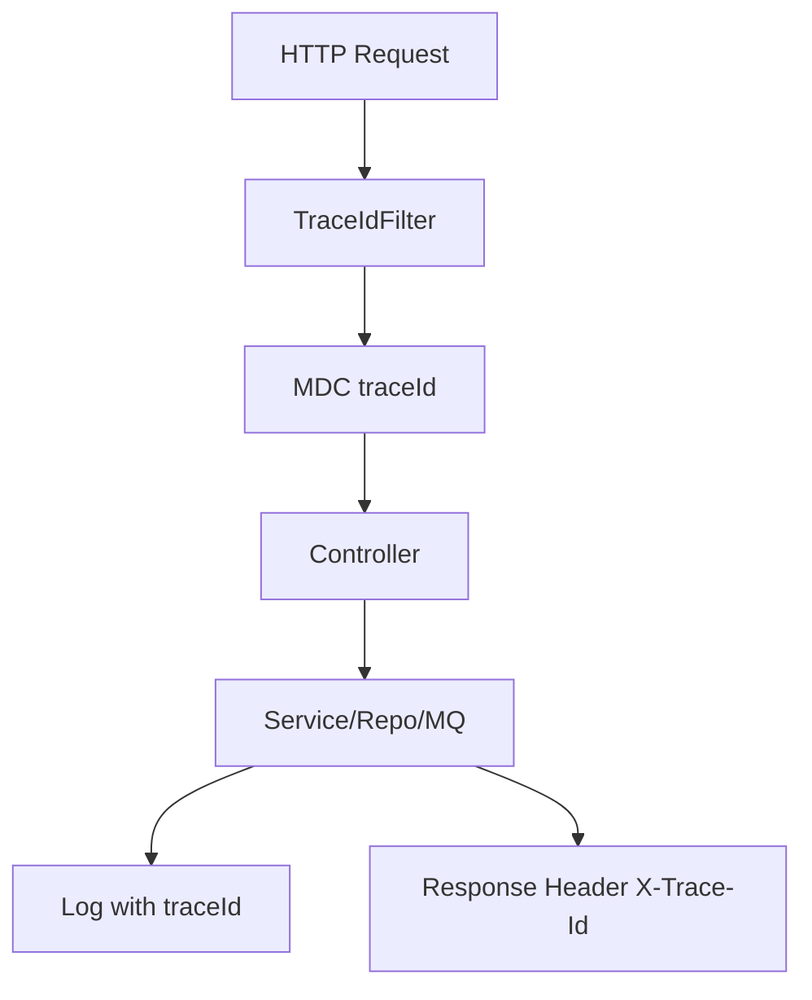
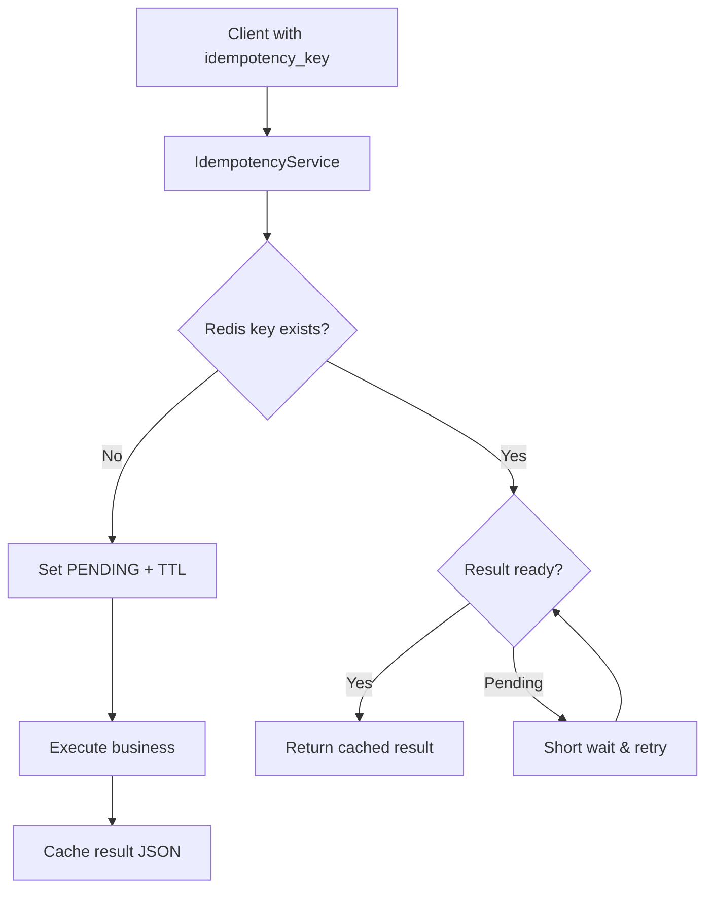
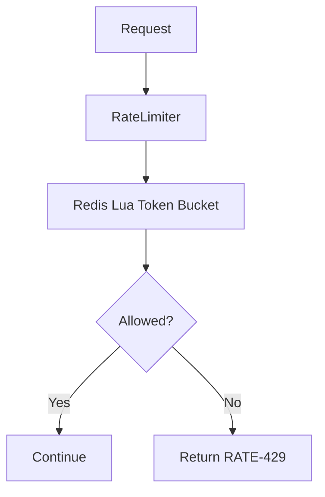
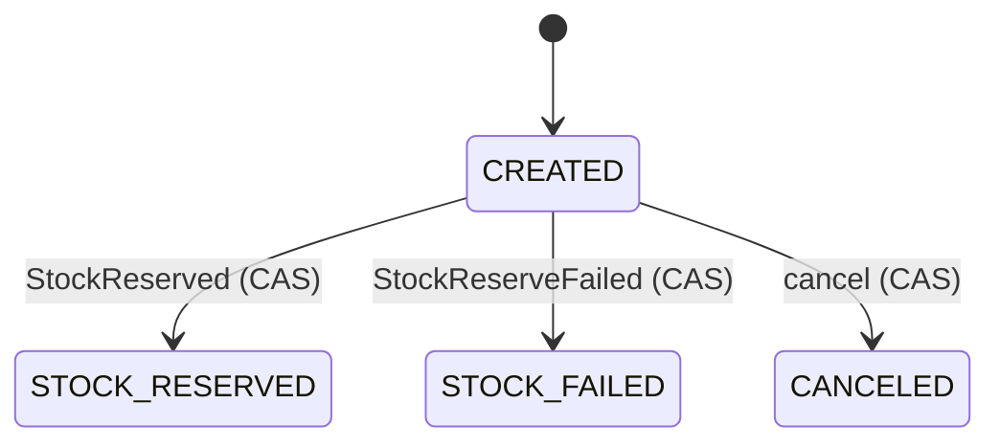
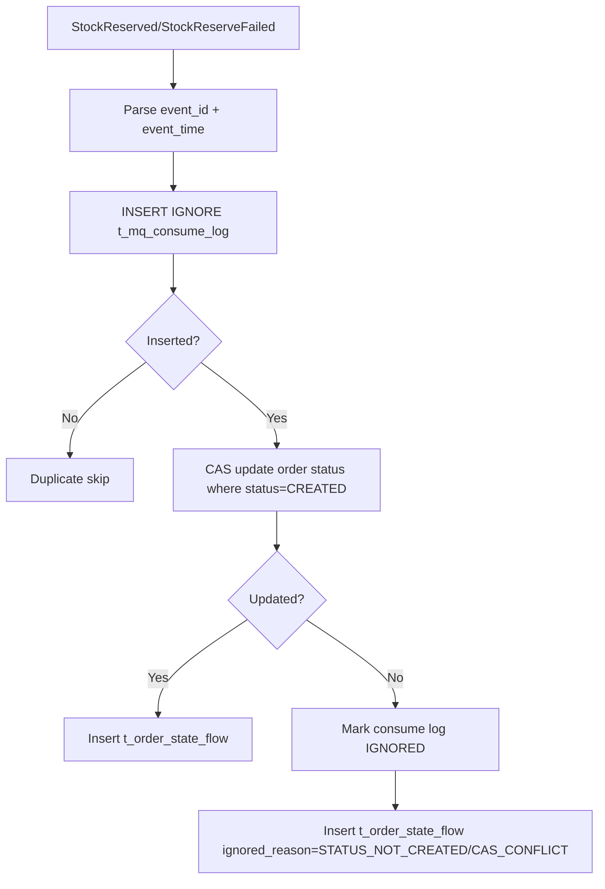

# Flowchart

## Trace 链路



## 幂等流程



## 限流流程



## 订单创建/取消流程（含幂等 + Outbox）

```mermaid
flowchart TD
    A[POST /orders] --> B[Resolve idempotency_key/clientRequestId]
    B --> C{Rate limit pass?}
    C -- No --> C1[Return RATE-429]
    C -- Yes --> D[IdempotencyService execute]
    D --> E{Order exists?}
    E -- Yes --> F[Return existing order]
    E -- No --> G[Insert t_order + t_order_item]
    G --> H[Insert t_order_state_flow CREATED]
    H --> I[Insert t_outbox_event OrderCreated]
    I --> J[Return order]

    K[POST /orders/{orderNo}/cancel] --> L[Resolve idempotency_key/clientRequestId]
    L --> M{Rate limit pass?}
    M -- No --> M1[Return RATE-429]
    M -- Yes --> N[IdempotencyService execute]
    N --> O{Status == CREATED?}
    O -- No --> P[Return error or already canceled]
    O -- Yes --> Q[CAS update status -> CANCELED]
    Q --> R[Insert t_order_state_flow CANCELED]
    R --> S[Insert t_outbox_event OrderCanceled]
    S --> T[Return order]
```

## 订单状态机



## 库存事件乱序处理（order-service）



## Outbox Relay + Retry + DLQ + 消费幂等

```mermaid
flowchart TD
    A[OutboxRelayWorker] --> B[Scan t_outbox_event NEW/RETRY & next_retry_at<=now]
    B --> C[Mark PROCESSING (claim)]
    C --> D[Send RocketMQ keys=event_id tag=OrderEvent header traceId]
    D --> E{Send success?}
    E -- Yes --> F[Mark SENT]
    E -- No --> G{retry_count >= max?}
    G -- No --> H[Exponential backoff -> status RETRY & next_retry_at]
    G -- Yes --> I[Mark DEAD + ALARM log]

    J[Consumer] --> K[Parse payload eventType]
    K --> L{eventType == OrderCreated?}
    L -- No --> M[Ignore]
    L -- Yes --> N[INSERT IGNORE t_mq_consume_log (event_id, consumer_group)]
    N --> O{Inserted?}
    O -- No --> P[Idempotent skip]
    O -- Yes --> Q[Business consume + log]
```

## 库存预占（Redis Lua + Outbox）流程

```mermaid
flowchart TD
    A[OrderCreated MQ] --> B[Consume Idempotent t_mq_consume_log]
    B --> C{Duplicate?}
    C -- Yes --> C1[Skip]
    C -- No --> D[Lua TryReserve inv:{warehouseId}:{skuId}]
    D --> E{available >= qty?}
    E -- No --> F[Insert Outbox StockReserveFailed]
    E -- Yes --> G[DB tx: update t_inventory + insert t_inventory_reservation]
    G --> H[Insert t_inventory_txn + state_flow]
    H --> I[Insert Outbox StockReserved]
```
